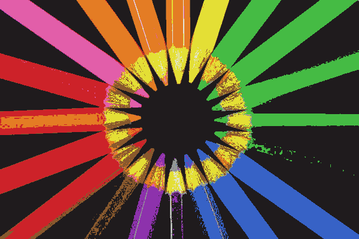

# Machine Learning and Color

Data, source code, documents and apps related to machine learning and color.

First, why learn color? 

The [MNIST handwritten digits](https://en.wikipedia.org/wiki/MNIST_database) is a widely used machine learning dataset.

But color provides a nice complement to the MNIST dataset in the following ways :

| colors | handwritten digits |
| --- | --- |
| a categorization problem | a classification problem |
| no fixed number of categories | fixed number of classes |
| includes multi-category (bluish green) | one class per digit |
| 5 to 10% adversarial | no adversarial |
| includes NSFW labels | entirely SFW |
| RGB input | image input |
| upper accuracy of 88% | upper accuracy of 99.8% |
| token label | character label |
| many misspellings | not applicable |
| includes [hapaxes](https://en.wikipedia.org/wiki/Hapax_legomenon) | not applicable |
| a direct visualization attribute | not applicable |
| categorical context | nominal context (zip codes) |
| compatible with 3D LUTs | not applicable |

