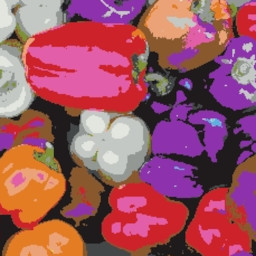

## Machine Learning and Color : Applications

Collection of interactive applications demonstrating machine learning of colors.

| Name | Application | Source | Thumbnail | Other |
| --- | --- | --- | --- | --- |
| [**K-Nearest Colors**](https://knearestcolors.streamlit.app) | [app](https://knearestcolors.streamlit.app) | [src](https://github.com/Numantic-NMoroney/KNearestColors) |  | [comments/questions](https://www.linkedin.com/feed/update/urn:li:activity:7248911412008214528/?actorCompanyId=104756822) |
| [**Random Color Forest**](https://randomcolorforest.streamlit.app) | [app](https://randomcolorforest.streamlit.app) | [src](https://github.com/Numantic-NMoroney/RandomColorForest/tree/main) |  | [comments/questions](https://www.linkedin.com/feed/update/urn:li:activity:7251414812268634112/?actorCompanyId=104756822) |
| [**Color Radial SVM**](https://colorradialsvm.streamlit.app)  | [app](https://colorradialsvm.streamlit.app) | [src](https://github.com/Numantic-NMoroney/ColorRadialSVM) |  | |
| [**Pixel Color Classifier**](https://pixelcolorclassifier.streamlit.app) | [app](https://pixelcolorclassifier.streamlit.app) | [src](https://github.com/Numantic-NMoroney/PixelColorClassifier) |  | |
