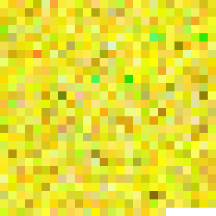
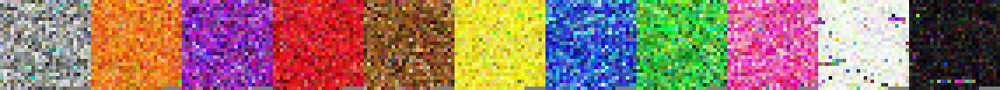

## Machine Learning Color : Centroid Process

Code for processing and visualizing color centroids.

This includes computing the average centroid color from a list of corresponding RGB values.

These centroids can be rendered as a solid image or a nearest neighbor upscaled image.

| solid image | individual RGB |
| -- | -- |
|  |  |

For the invidual RGB example above for the color term 'yellow' each upscaled pixel is a human label.

These invidual centroids can also be row stacked. Below are 11 basic color terms as solid images :

And the same as individual RGB images :

