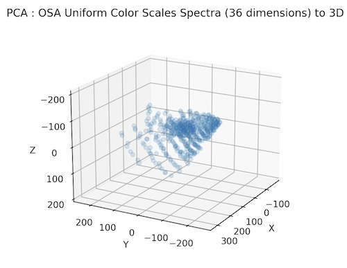

## Machine Learning Color : Principle Component Analysis

Perform dimensioanlity reduction using [Principle Component Analysis](https://scikit-learn.org/1.5/auto_examples/decomposition/plot_pca_iris.html) ([PCA](https://scikit-learn.org/dev/modules/generated/sklearn.decomposition.PCA.html)). 

The input is spectral data (36 dimensions) for the Optical Society of America (OSA) [Uniform Color Scales](https://en.wikipedia.org/wiki/OSA-UCS).

Principle Component Analysis is used to transform this spectral data to 3 dimensions which can then be plotted as :

