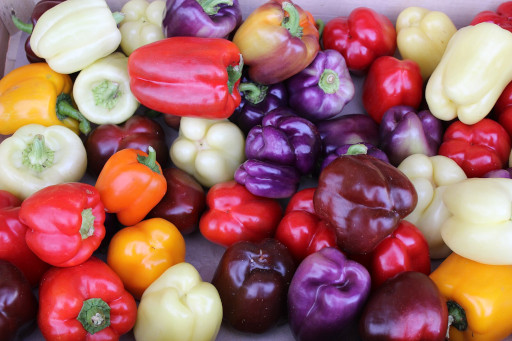

## Machine Learning and Color : Pixel Color Classifier

Use a pre-computed [Look Up Table](https://github.com/NMoroney/MachineLearningAndColor/tree/main/src/mlc_pixel_lut) (or LUT) to perform efficient per-pixel color classification.

This example uses a LUT computed using a [Radial SVM](https://github.com/NMoroney/MachineLearningAndColor/tree/main/src/mlc_radial_svm) and 17 color terms.

The result of processing this input image :

 → [attribution](https://commons.wikimedia.org/wiki/File:Colorful_Bell_Peppers.JPG)

Is the per-pixel color term classified image below :

---

There is also an interactive Streamlit application based on this :

