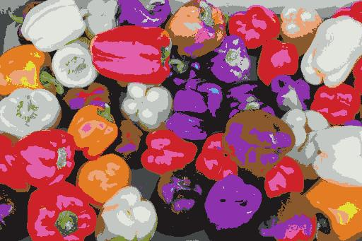
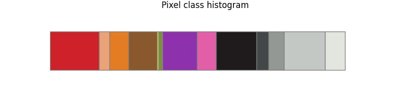

## Machine Learning Color : Pixel Class Histogram

For a given input RGB image compute a per-pixel classification histogram.

As an example, given the classifed image below :

A horizontally stacked bar chart can be generated as the histogram.

The above histogram is hue sorted for the chromatic color terms and lightness sorted for achromatic color terms.
