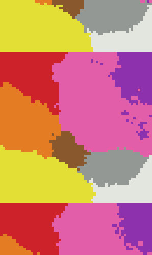

## Machine Learning Color : Pixel LUT

A convenient aspect of machie learning of color is that the prediction process can take advantage of [look up tables](https://en.wikipedia.org/wiki/3D_lookup_table) (or LUTs).

Pre-computing classifier results for a dense 3D sampling of RGB values yields a LUT.

This LUT can be used to quickly classify pixels. This code computes a 65 x 65 x 65 LUT for a K-nearest neighbor (with k = 17) and saves the result as a PNG image.

A cropped and zoomed portion of the LUT is shown below :

