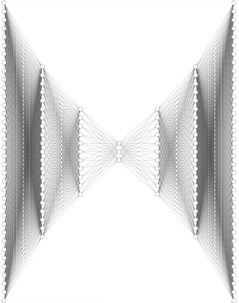
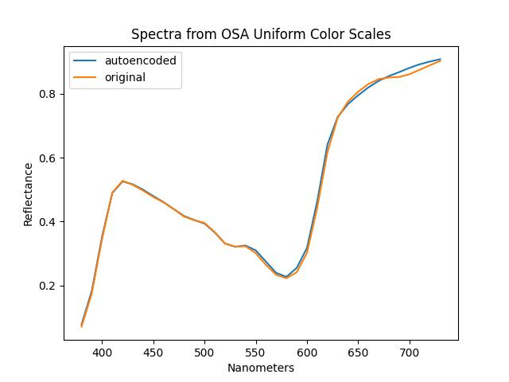

## Machine Learning Color : PyTorch Autoencoder

Use a [PyTorch](https://pytorch.org) [autoencoder](https://en.wikipedia.org/wiki/Autoencoder) to apply dimensionality reduction to input spetra for the OSA [Uniform Color Scales](https://en.wikipedia.org/wiki/OSA-UCS).

The enocder has layers of 36 : 21 : 11 and 3. The bottleneck is therefore to three dimensions.

The full encoder and decoder network is shown below :

And an example of the original and autoencoded spectra is shown next :

