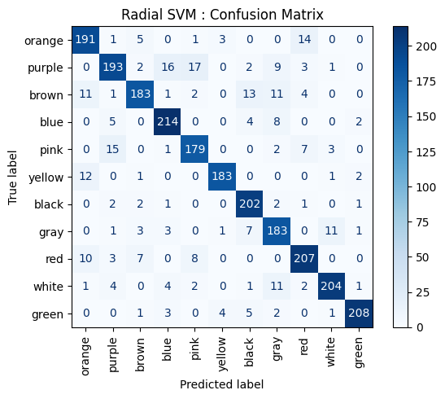

## Machine Learning Color : Confusion Matrix

For the [radial SVM classifier](https://github.com/NMoroney/MachineLearningColor/tree/main/src/mlcolor_radialsvm), compute the [confusion matrix](https://scikit-learn.org/1.5/modules/generated/sklearn.metrics.confusion_matrix.html) for the trained classifier.

In addition, use [confusion matrix display](https://scikit-learn.org/1.5/modules/generated/sklearn.metrics.ConfusionMatrixDisplay.html) to visualize the resulting matrix.

