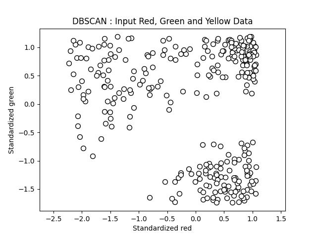

## Machine Color Learning : DBSCAN Clustering

For input human labeled red, green and yellow values the [DBSCAN algorithm](https://scikit-learn.org/dev/modules/generated/sklearn.cluster.DBSCAN.html) is used to cluster the data.

[DBSCAN](https://en.wikipedia.org/wiki/DBSCAN) is an abbreviation for "Density-based spatial clustering of applications with noise".

As a pre-processing step a [standard scaler](https://scikit-learn.org/dev/modules/generated/sklearn.preprocessing.StandardScaler.html) is applied. 

The resulting first and second channels (originally red and green) are shown plotted below for the input data :

The algorithm has a parameter eps or ε which was manually set to 0.65. This resulted in 3 clusters and 32 noise points.

The DBSCAN clustering results are shown next :

