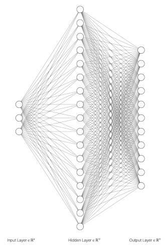

## Machine Learning Color : PyTorch Neural Network

Use [PyTorch](https://pytorch.org) to fit a neural network classifer to the 11 color term training data.

In this example, a 3 input to 17 hidden layer to 11 output network is used.



And resulted in the following result :

```
<bound method Module.parameters of Network(
  (linear1): Linear(in_features=3, out_features=17, bias=True)
  (linear2): Linear(in_features=17, out_features=11, bias=True)
)>
[ epoch : 0 ] loss : 0.06032
[ epoch : 50 ] loss : 0.02181
[ epoch : 100 ] loss : 0.01494
[ epoch : 150 ] loss : 0.01303
[ epoch : 200 ] loss : 0.01243
[ epoch : 250 ] loss : 0.01199
[ epoch : 300 ] loss : 0.01175
labels :
tensor([ 0,  7,  2,  8,  0,  1,  1,  0,  9,  3,  6,  0,  7,  7,  7,  5,  3,  1,
         2,  6, 10, 10,  2,  7,  8,  0,  5,  5,  5,  2,  8,  8,  8,  4,  3,  9,
         9,  7,  2,  8,  1,  3,  9, 10,  0,  1,  1,  5,  9,  3,  7,  6,  4,  5,
         7,  4,  5, 10,  6,  3,  0,  8,  6,  5,  7,  4,  6,  3,  9,  1,  7,  8,
         0, 10,  9,  5,  9, 10,  2, 10,  4,  5, 10,  4,  8,  7,  0,  7,  3,  6,
         5,  8,  2,  0,  0,  9,  3, 10,  2,  7])
predicted :
tensor([ 0,  7,  2,  9,  0,  1,  9,  0,  9,  3,  7,  0,  5,  7,  7,  5,  3,  8,
         2,  6, 10, 10,  2,  7,  8,  0,  5,  5,  5,  2,  7,  0,  8,  4,  2,  9,
         9,  7,  2,  2,  1,  3,  9, 10,  0,  1,  1,  5,  9,  3,  5,  6,  4,  5,
         7,  4,  5, 10,  6,  3,  0,  8,  6,  5,  7,  4,  6,  3,  9,  1,  7,  8,
         0,  4,  9,  5,  9, 10,  2, 10,  4,  5, 10,  4,  8,  7,  0,  7,  3,  6,
         5,  8,  1,  0,  0,  9,  0, 10,  2,  7])
accuracy : 86%
```
