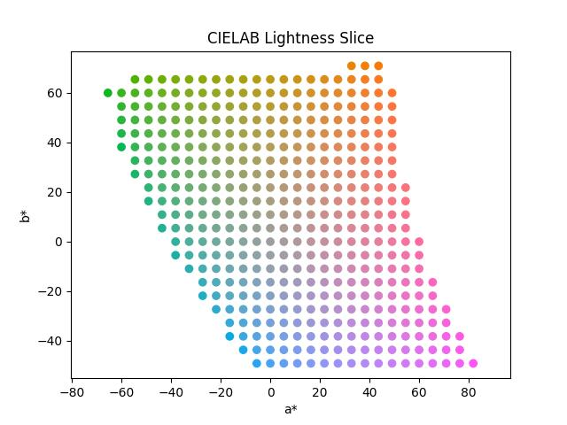
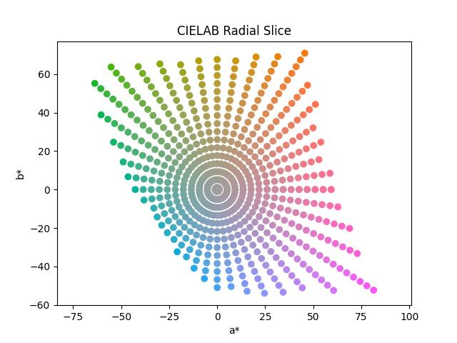
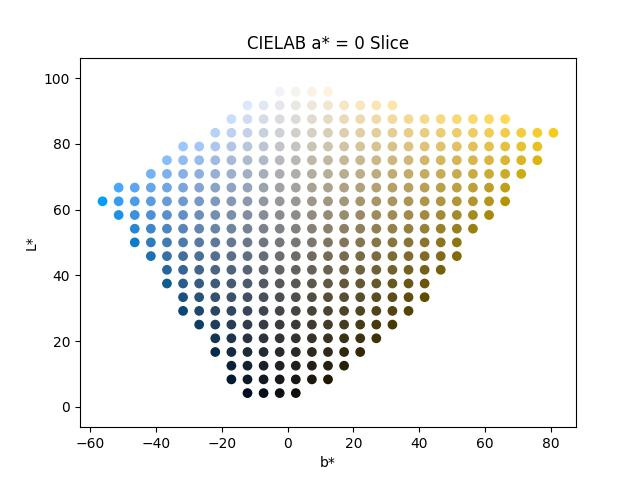
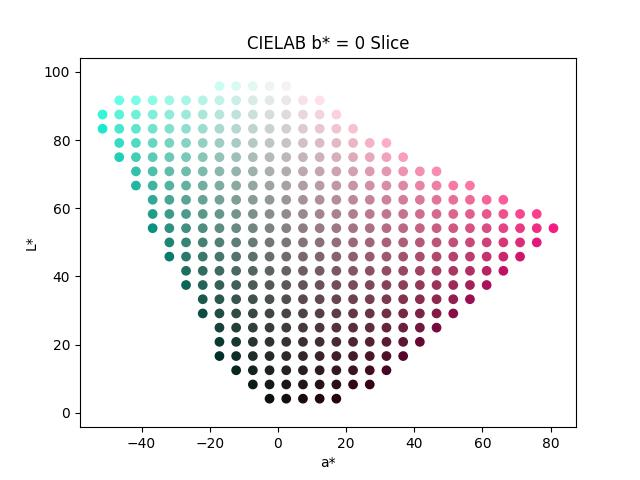

## Machine Learning Color : Sample Plane

Compute 2d color samples on a plane. 

These examples use the [CIELAB](https://en.wikipedia.org/wiki/CIELAB_color_space) color space and are limited to being inside the [sRGB](https://en.wikipedia.org/wiki/SRGB) [gamut](https://en.wikipedia.org/wiki/Gamut).

First is constant lightness plane sampling :

Second is a constant lightness plane but with radial sampling :

Third is an a* slice of the data :

Finally is a b* sampling of the colors :

